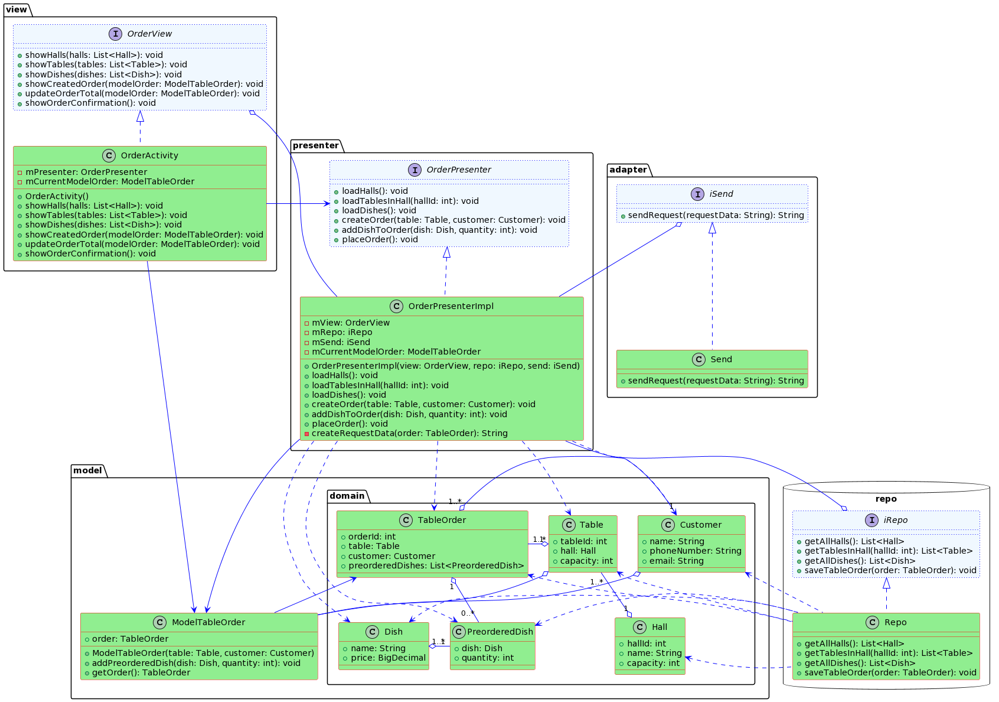

## Архитектура ПО (семинары)
### Урок 8. Типы архитектур прикладных приложений (мобильные): MVC, MVP, MVVM.

Для приложения заказа столика в ресторане сделать архитектурные документы:

1. Разработать экранные формы интерфейса(UI/UX) в https://www.figma.com/ или https://app.diagrams.net/.

2. Разработать полную ERD домена в https://www.dbdesigner.net/.

3. Разработать UML диаграмму классов

***

В этом примере представлено приложение для заказа столика в ресторане. Презентер связывает представление (OrderActivity) и модель (репозиторий и отправка данных), обеспечивая взаимодействие пользователя с приложением. Представление отображает доступные залы, столы, блюда, и итоговую сумму заказа, а также подтверждение заказа. Модель предоставляет данные о залах, столах и блюдах через репозиторий, а также обеспечивает отправку данных через интерфейс iSend.

***

* ERD диаграмма

* UML Вариант 1 - до реализации в коде:

* Скрин примера выполнения приложения на Java

* UML Вариант 2 - после реализации примера на Java

* Макет интерфейса 

