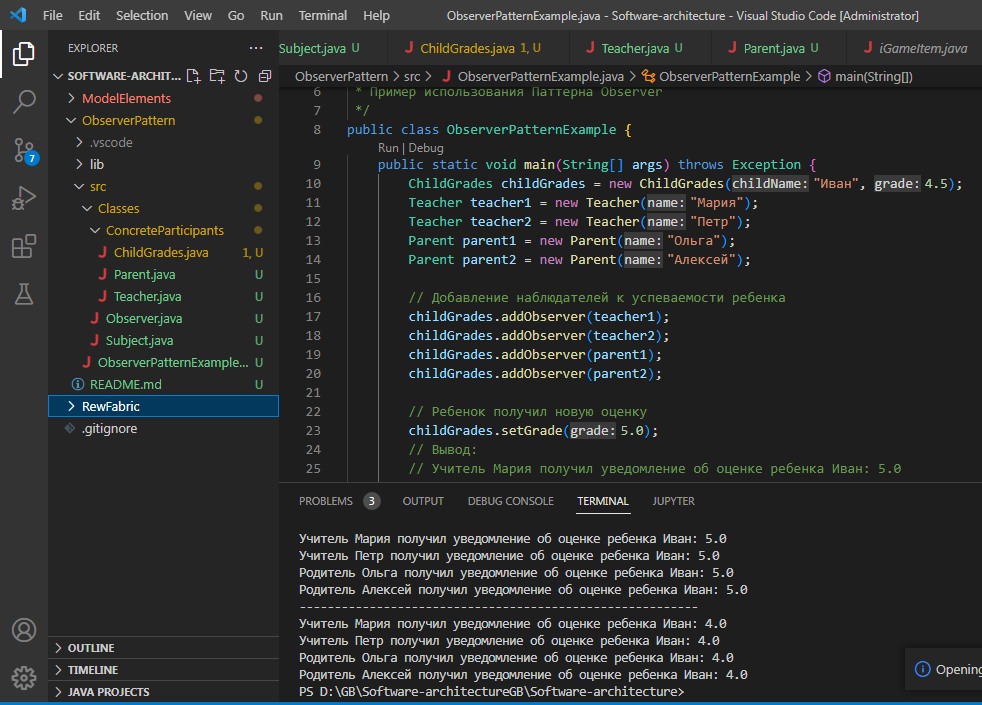

## Задание 2. Познакомиться с другими типами паттернов (задание по желанию). Сделать пример кода одного из паттенрнов, можно синглтон.
***

### Паттерн Наблюдатель (Observer)
***
Паттерн Наблюдатель (Observer) — это поведенческий паттерн проектирования, который позволяет создать механизм подписки и уведомления об изменениях в объектах, таким образом, что одни объекты (наблюдатели) автоматически получают оповещения о событиях происходящих в других объектах (субъектах), которые они наблюдают.

Основные участники паттерна:

1. Subject (Субъект) — предоставляет интерфейс для подписки, отписки и уведомления наблюдателей.
2. ConcreteSubject (Конкретный субъект) — реализует интерфейс Subject и хранит состояние, которое может быть изменено. Уведомляет своих наблюдателей об изменениях.
3. Observer (Наблюдатель) — определяет интерфейс для получения уведомлений.
4. ConcreteObserver (Конкретный наблюдатель) — реализует интерфейс Observer и получает уведомления от субъекта при изменении его состояния.
***
Пример простой задачи:
 реализуем систему, где успеваемость детей в школе является субъектом, а учителя и родители будут наблюдателями. Когда успеваемость ребенка изменяется, все наблюдатели получат уведомления и смогут реагировать соответственно.

 В этом примере ChildGrades является субъектом, предоставляющим информацию об успеваемости ребенка. Учителя и родители являются наблюдателями. Когда успеваемость ребенка изменяется, метод setGrade в ChildGrades вызывает notifyObservers, что приводит к уведомлению всех наблюдателей о новой оценке. В результате, учителя и родители могут реагировать на изменения успеваемости ребенка, выполняя свои соответствующие действия.

Вывод:

