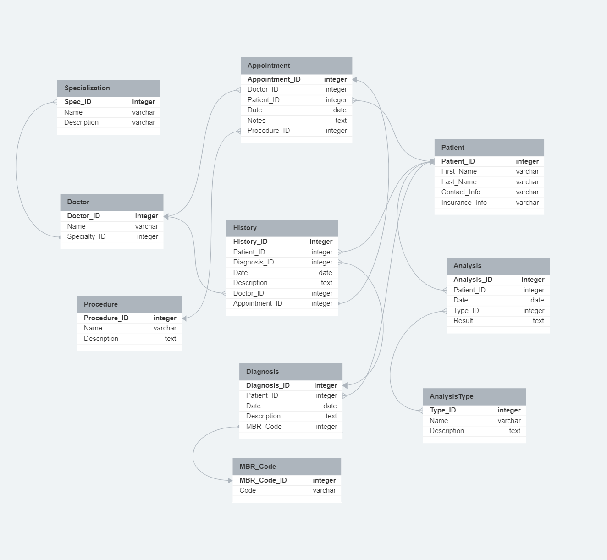
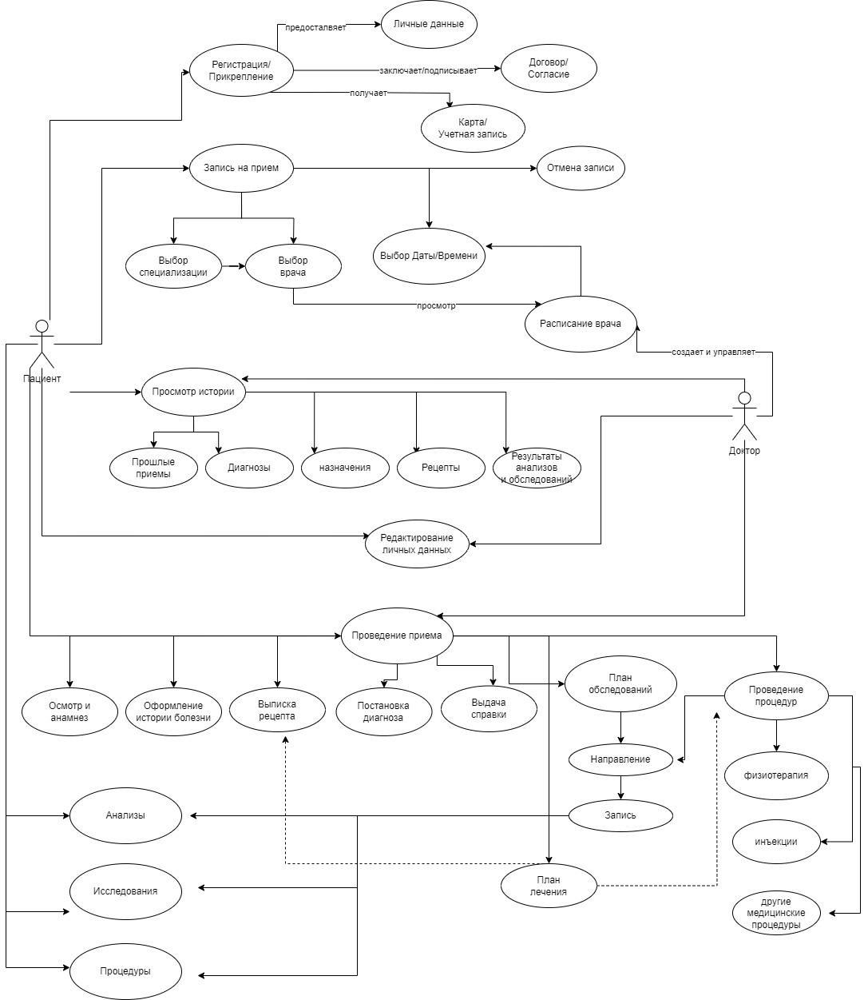

### Урок 6. Принципы построения приложений «чистая архитектура»

Разработать полную ERD домена приложения автоматизации работы поликлиники( в https://www.dbdesigner.net/).

Разработать UseCase диаграмму пациента и доктора в приложении автоматизации работы поликлиники.

