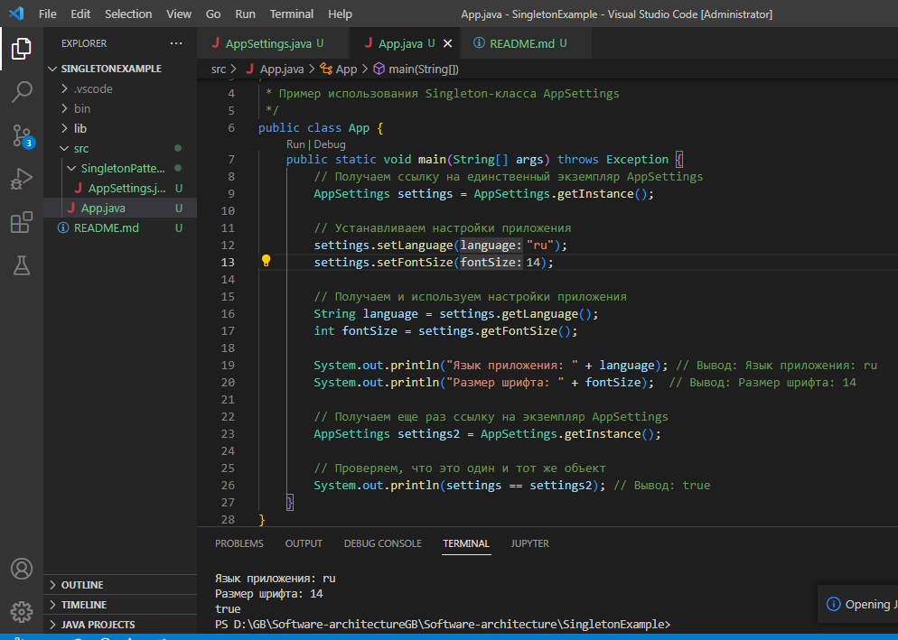

## Паттерн Singleton (Одиночка)

Это порождающий паттерн проектирования, который гарантирует, что у класса есть только один экземпляр, и предоставляет глобальную точку доступа к этому экземпляру.

Основные элементы паттерна:

1. Приватный статический член класса для хранения экземпляра объекта.
2. Приватный конструктор, чтобы предотвратить создание экземпляров класса извне.
3. Статический метод для получения ссылки на экземпляр класса.

Примером, где можно использовать паттерн Singleton, может быть работа с настройками (конфигурацией) приложения. Допустим, у нас есть класс AppSettings, который хранит настройки приложения, и нам нужно гарантировать, что настройки будут доступны во всех частях приложения и существуют только в одном экземпляре.

Пример реализации паттерна Singleton для класса AppSettings.

